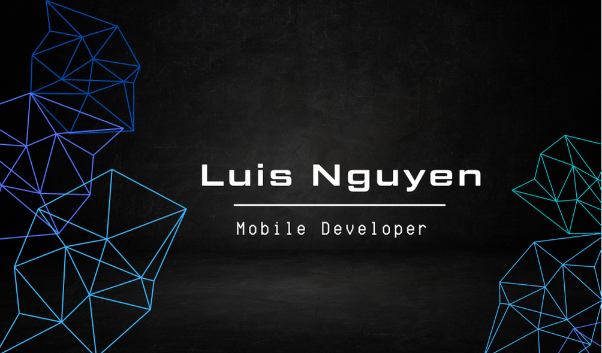
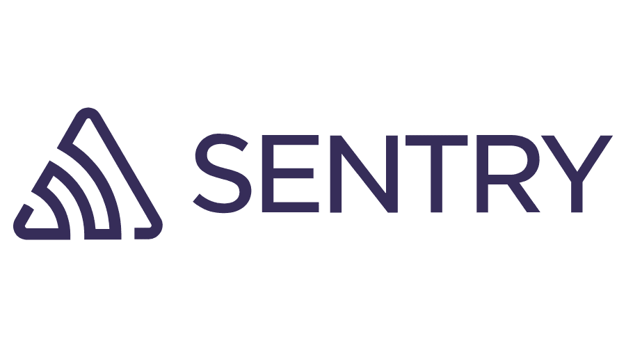

  
  
  
   <a target="_blank">
    

# Hello Folks! 👋

 

I'm [Nguyen Thanh Phap (Luis Nguyen)](https://github.com/nguyenthanhphap1413). Currently, I'm Senior Specialist Mobile Deveope at FE CREDIT.

I'm from VietNam 🇻🇳 , living in Ho Chi Minh City.

# Contact me 📒 :

  

- 🔭 I’m currently working on my project [iCollect](https://play.google.com/store/apps/details?id=com.fe.icollect&hl=vi&gl=US)
- 👯 I’m looking to collaborate on [Github Readme Stats](https://github.com/nguyenthanhphap1413/nguyenthanhphap1413)
- 💬 Ask me about anything [here](https://github.com/nguyenthanhphap1413/nguyenthanhphap1413/issues)

 

## Languages and Tools ⚙️ :

 

 

  
_NOTE: Top languages does not indicate my skill level or something like that, it's a github metric of which languages i have the most code on github, it's a new feature of [github-readme-stats](https://github.com/ToanMobile/ToanMobile/issues)_

 
<a href="https://github.com/ToanMobile/ToanMobile">
  <!-- Change the `github-readme-stats.anuraghazra1.vercel.app` to `github-readme-stats.vercel.app`  -->
  
</a>

# Expert Skills 🎯 :

 

 

# Other Skills 🎯 :

## VERSION CONTROL:

 

 

## CI/CD:

 

## UX/UI:

 

 

## Services:

 

</a>
 

 

# Project 📂 :

 
<table bordercolor="#66b2b2" style="border-radius: 10%">
  <tr align="center">
    <td width="50%" valign="top">
      <h2 align="center">iCollect</h2>
         
        
         
        

  </a >
      

        
<strong>Dart/Flutter, Codemagic</strong>

        
 <strong>Platforms </strong>: <a href="https://play.google.com/store/apps/details?id=com.fe.icollect&hl=vi&gl=US">Android</a>, IOS(App-Inhouse deploy with S3 AWS).

    </td>
    <td width="50%" valign="top">
      <h2 align="center">Propcom</h2>
         
         
            

         
        

    
 
<strong>Dart/Flutter</strong>

        
 <strong>Platforms </strong>: <a href="https://play.google.com/store/apps/details?id=vn.propcom.app&hl=vi&gl=US">Android</a>, <a href="https://apps.apple.com/vn/app/propcom-k%E1%BA%BFt-n%E1%BB%91i-b%E1%BB%81n-v%E1%BB%AFng/id1551955496?l=vi&platform=iphone"> IOS</a>.

  </a>
     
  </tr>

  <tr>
    <td width="50%" valign="top" align="center">
      <h2>Hasaki Training</h2>
       
         
 

       
        

           
      

       
<strong>Dart/Flutter</strong>

        
 <strong>Platforms </strong>: <a href="https://play.google.com/store/apps/details?id=training.hasaki.vn&hl=ky&gl=US">Android</a>, <a href="https://apps.apple.com/vn/app/hsk-training/id1512712933"> IOS</a>.

    </td>
    <td width="50%" valign="top" align="center" >
      <h2>Ngoc Dung Beauty</h2>
         
          
             
        

        
<strong>Dart/Flutter</strong>

        
 <strong>Platforms </strong>: <a href="https://play.google.com/store/apps/details?id=com.ngocdungaesthetic.marketingapp&hl=vi&gl=US">Android</a>, <a href="https://apps.apple.com/vn/app/ngoc-dung-beauty/id1437360091?platform=iphone"> IOS</a>.

        

         
        

           
      

    </td>
  </tr>
</table>
